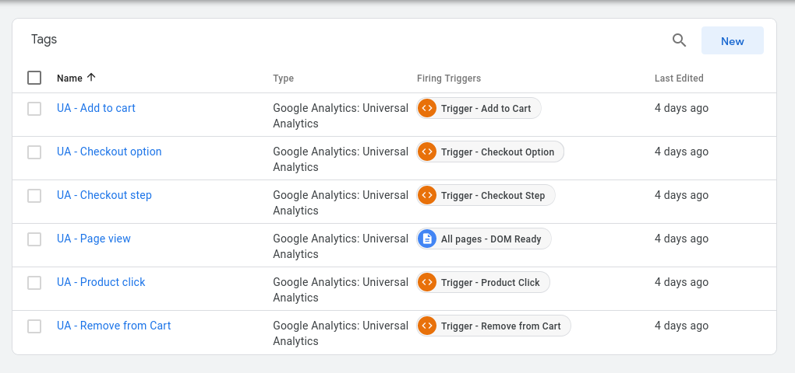
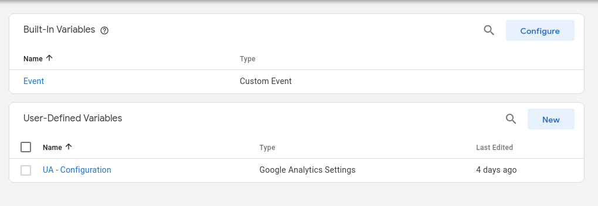

# Google Tag Manager Enhanced Ecommerce plugin for Sylius eCommerce platform

[](https://packagist.org/packages/stefandoorn/sylius-google-tag-manager-enhanced-ecommerce-plugin)
[](https://packagist.org/packages/stefandoorn/sylius-google-tag-manager-enhanced-ecommerce-plugin)
[](https://github.com/stefandoorn/sylius-google-tag-manager-enhanced-ecommerce-plugin/actions/workflows/build.yml)

<p align="center"><a href="https://sylius.com/plugins/" target="_blank"></a></p>

## Note

This plugin now supports both UA (deprecated by Google) & GA4. Not all GA4 features are already implemented.

The following migration guide has been used to move to GA4: https://support.google.com/analytics/answer/10119380?hl=en

## Installation

### 1. Composer

`composer require stefandoorn/sylius-google-tag-manager-enhanced-ecommerce-plugin`

### 2. Follow installation instructions of required sub bundle

https://github.com/stefandoorn/google-tag-manager-plugin

### 3. Load bundle

Add to `bundles.php`:

```php
StefanDoorn\SyliusGtmEnhancedEcommercePlugin\SyliusGtmEnhancedEcommercePlugin::class => ['all' => true],
```

### 4. Adjust configurations

Configure the features you would like to use/not. Find a base configuration reference by running:

```
bin/console config:dump-reference SyliusGtmEnhancedEcommercePlugin
```

### 5. Install assets

```
bin/console assets:install
bin/console sylius:install:assets
bin/console sylius:theme:assets:install
```

By default all features are enabled.

## Features

Features available:

*For Universal Analytics (deprecated by Google)*:

* [purchases](docs/UA/purchases.md): Send purchases to GTM.
* [product_impressions](docs/UA/product_impressions.md): Send impressions on product listings to GTM
* [product_detail_impressions](docs/UA/product_detail_impressions.md): Send impression on product detail pages to GTM
* [product_clicks](docs/UA/product_clicks.md): Send click events on product links to GTM
* [cart](docs/UA/cart.md): Send add to cart / remove from cart events to GTM
* [checkout](docs/UA/checkout.md): Send checkout steps & selected options to GTM

*For GA4*:

References + examples of how to set-up your GTM container: https://developers.google.com/analytics/devguides/collection/ga4/ecommerce?client_type=gtm

Supported events:

* `view_item`
* `view_item_list`
* `add_to_cart`
* `remove_from_cart`
* `view_cart`
* `begin_checkout`
* `add_shipping_info`
* `add_payment_info`
* `purchase`

Other features included in UA, but not in GA4, are *Work In Progress*.

Make sure to check that the required 'sonata_block_render_events' template events are available. Check the
`src/Resources/config/features/*.yml` & `src/Resources/config/services.yml` for the definitions.

This is only to be checked if you've been overriding templates yourselves.

## Bootstrap a GTM container (Universal Analytics (deprecated by Google))
You can find a GTM container fully configured that work with the test application in `docs/UA/GTM-EXAMPLE.json`.

This file can be imported to easily configure your container.


It will add thoses tags and triggers




You will have to replace the UA-111111111-1 by your own Universal Analytics ID




## Features not supported (yet):

* `promotion_impressions`: https://developers.google.com/tag-manager/enhanced-ecommerce#promo-impressions
* `promotion_clicks`: https://developers.google.com/tag-manager/enhanced-ecommerce#promo-clicks
* `refunds`: https://developers.google.com/tag-manager/enhanced-ecommerce#refunds

## Cache Resolvers

It might be that your data resolvers give a performance hit, e.g. on the product show page.
There are decorators available that allow you to cache the results for a set time in order. Take a look
at the service definitions in `cache_services.yml` & the default configuration on how to enable this setting.
